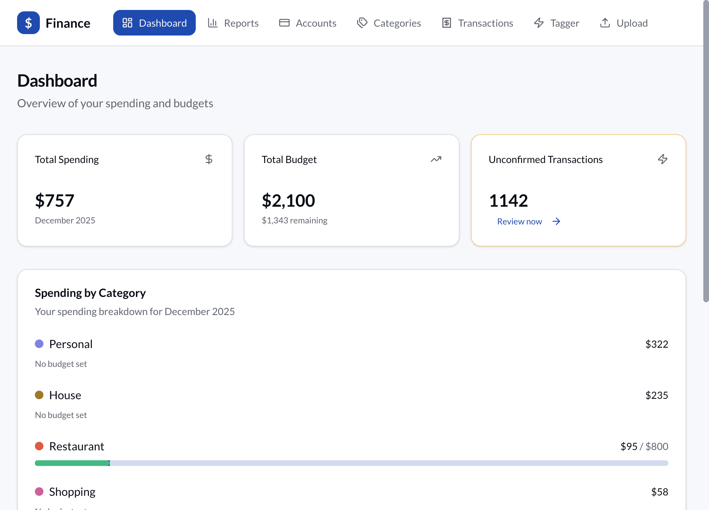
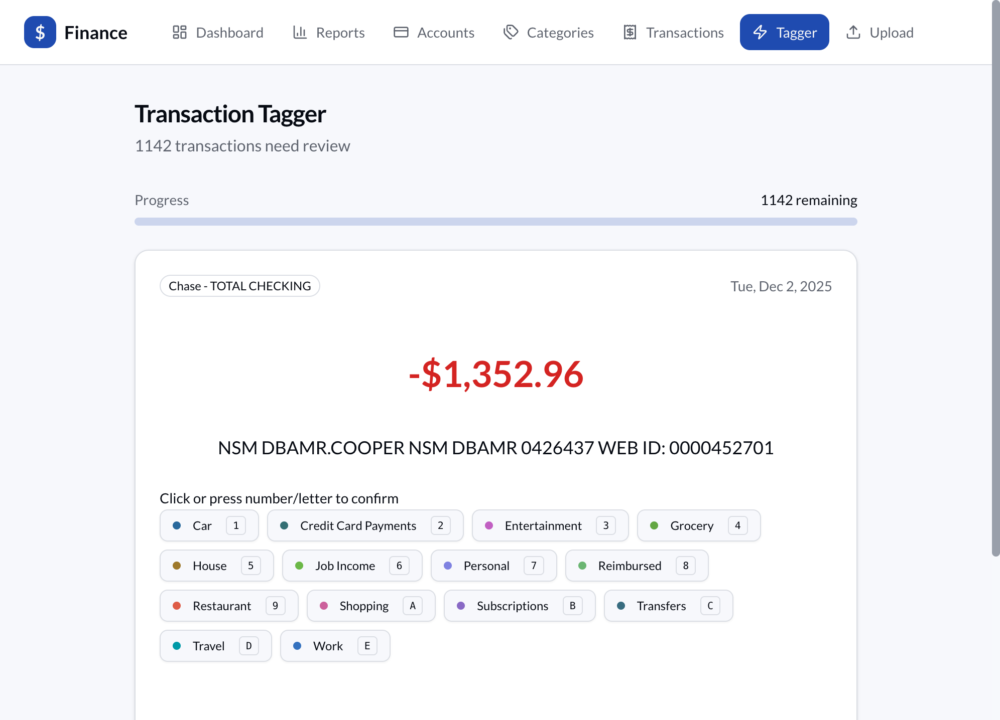
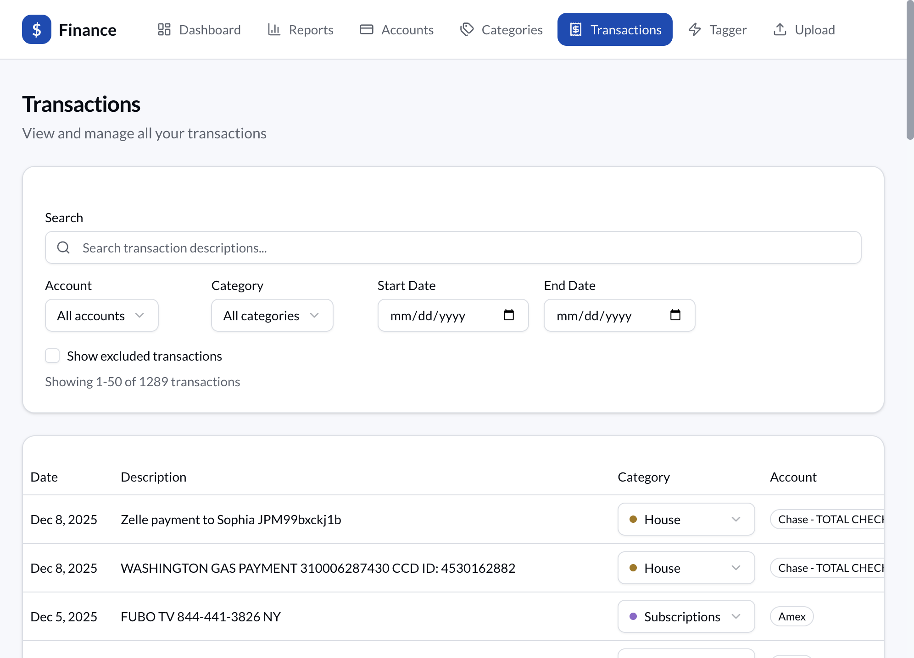
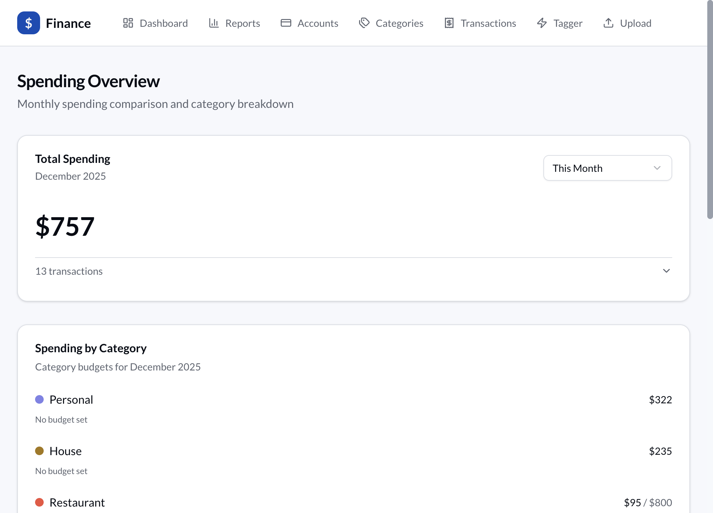
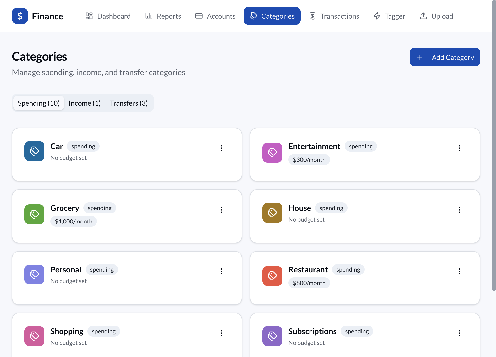
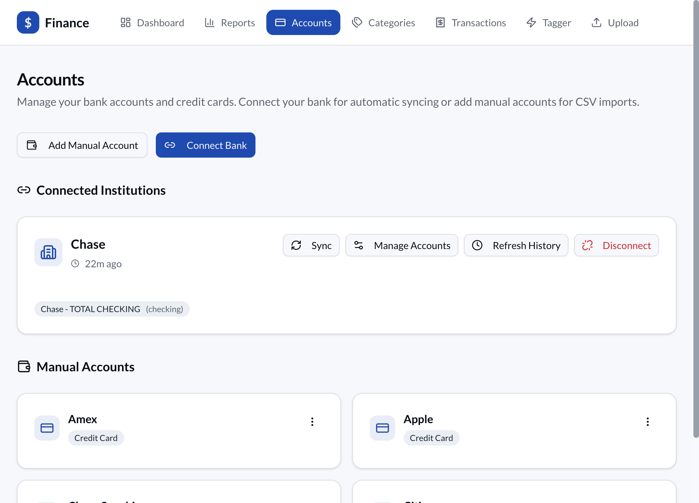

# Somar

A modern, privacy-focused personal finance app for tracking spending and income. Import bank statements, auto-categorize transactions, and track spending against budgets — all running locally on your machine.


## Screenshots

<table>
  <tr>
    <td width="50%">
      
      <p align="center"><strong>📊 Dashboard</strong><br/>At-a-glance overview of spending, budgets, and unconfirmed transactions</p>
    </td>
    <td width="50%">
      
      <p align="center"><strong>⚡ Tinder-Style Tagger</strong><br/>Quickly categorize transactions with swipes, keyboard shortcuts, or clicks</p>
    </td>
  </tr>
  <tr>
    <td width="50%">
      
      <p align="center"><strong>📋 Transactions</strong><br/>Search, filter, and manage all your transactions with powerful filters</p>
    </td>
    <td width="50%">
      
      <p align="center"><strong>📈 Spending Reports</strong><br/>Track monthly spending with category breakdowns and budget progress</p>
    </td>
  </tr>
  <tr>
    <td width="50%">
      
      <p align="center"><strong>🏷️ Category Management</strong><br/>Organize spending, income, and transfer categories with monthly budgets</p>
    </td>
    <td width="50%">
      
      <p align="center"><strong>🏦 Bank Connections</strong><br/>Connect via Plaid for automatic syncing or add manual accounts for CSV imports</p>
    </td>
  </tr>
</table>

## Monorepo Structure

This project uses **Turborepo** with **pnpm workspaces** to manage multiple apps:

```
somar/
├── apps/
│   ├── web/              # Next.js web application
│   └── mobile/           # React Native/Expo app (coming soon)
├── packages/
│   └── shared/           # Shared types and utilities
├── turbo.json            # Turborepo configuration
└── pnpm-workspace.yaml   # pnpm workspace config
```

### Apps

| App | Description | Status |
|-----|-------------|--------|
| `@somar/web` | Next.js web application | ✅ Active |
| `@somar/mobile` | React Native/Expo mobile app | 🚧 Planned |

### Packages

| Package | Description |
|---------|-------------|
| `@somar/shared` | Shared TypeScript types and utilities |

## Features

### Tinder-Style Transaction Tagger
Quickly categorize transactions with swipe gestures or keyboard shortcuts. The app learns from your choices and auto-categorizes future transactions.

- **Swipe right** or press `Y` → Confirm category
- **Swipe left** or press `N` → Skip
- **Press `E`** → Exclude transaction
- **Press `Z`** → Undo last action
- Click any category pill to instantly assign

### Smart CSV Import
Import bank and credit card statements with intelligent column detection.

- Auto-detects date, description, and amount columns
- Handles different sign conventions (some banks show expenses as positive)
- Duplicate detection prevents importing the same transactions twice
- Works with exports from any bank

### Bank Connections via Plaid
Connect directly to 12,000+ financial institutions for automatic transaction syncing.

- Chase, Amex, Fidelity, Robinhood, and more
- Automatic background sync
- Secure OAuth authentication

### Budget Tracking
Set monthly budgets per category and track your progress with visual progress bars.

- Historical budget tracking (budgets apply from start month onwards)
- Dashboard shows spending vs budget at a glance
- Color-coded progress indicators

### Reports & Analytics
Understand your spending patterns with visual reports.

- Monthly spending overview
- Burn-up charts comparing this month to last
- Category breakdowns

## Quick Start

### Prerequisites

- Node.js 18+
- pnpm 9+

### Installation

```bash
# Clone the repository
git clone https://github.com/yourusername/somar.git
cd somar

# Install dependencies
pnpm install

# Set up the database
pnpm --filter web db:push
pnpm --filter web db:seed

# Start the development server
pnpm dev
```

Open [http://localhost:3000](http://localhost:3000) to see the app.

### Demo Mode (Quick Preview)

Want to see the app with realistic data right away? Use demo mode:

```bash
# Run demo mode (resets demo DB and starts dev server)
pnpm --filter web demo
```

This creates a separate `finance-demo.db` with:
- 6 accounts (checking, credit cards, savings, investment)
- 3 mock Plaid connections (Chase, Amex, Fidelity)
- 680+ transactions over 12 months
- Realistic spending patterns and merchant names
- Pre-set budgets for all categories

Perfect for testing features without connecting your real data!

**See [DEMO.md](DEMO.md) for more details.**

### Plaid Setup (Optional)

To enable bank connections, create a [Plaid](https://plaid.com) account and add your credentials:

```bash
# Copy the example environment file (in apps/web/)
cp apps/web/.env.example apps/web/.env.development

# Edit apps/web/.env.development and add:
PLAID_CLIENT_ID=your_client_id
PLAID_SECRET=your_sandbox_secret
PLAID_ENV=sandbox
```

## Usage

### Getting Started

1. **Add an account** — Go to Accounts and either connect a bank via Plaid or create a manual account for CSV imports
2. **Import transactions** — Upload a CSV export from your bank, or let Plaid sync automatically
3. **Categorize** — Use the Tagger to quickly categorize transactions. The app learns your preferences!
4. **Set budgets** — Go to Categories and set monthly budgets for spending categories
5. **Track progress** — The dashboard shows your spending vs budgets at a glance

### Keyboard Shortcuts (Tagger)

| Key | Action |
|-----|--------|
| `Y` or `→` | Confirm suggested category |
| `N` or `←` | Skip to next transaction |
| `E` | Exclude from spending calculations |
| `Z` | Undo last action |

## Tech Stack

- **Monorepo:** [Turborepo](https://turbo.build) with pnpm workspaces
- **Framework:** [Next.js 16](https://nextjs.org) with App Router
- **Database:** SQLite via [Prisma](https://prisma.io) (runs locally, no server needed)
- **UI:** [shadcn/ui](https://ui.shadcn.com) + [Tailwind CSS](https://tailwindcss.com)
- **Animations:** [Framer Motion](https://www.framer.com/motion/)
- **Charts:** [Recharts](https://recharts.org)
- **Bank Connections:** [Plaid](https://plaid.com)

## Project Structure

```
somar/
├── apps/
│   ├── web/                    # Next.js web app
│   │   ├── src/
│   │   │   ├── app/            # Next.js App Router pages
│   │   │   ├── actions/        # Server Actions
│   │   │   ├── components/     # React components
│   │   │   └── lib/            # Utilities & database
│   │   ├── prisma/             # Database schema
│   │   └── public/             # Static assets
│   └── mobile/                 # React Native app (planned)
├── packages/
│   └── shared/                 # Shared code
├── docs/                       # Documentation
└── turbo.json                  # Turborepo config
```

## Commands

### Root Commands (Turborepo)

```bash
pnpm dev          # Start all apps in dev mode
pnpm build        # Build all apps
pnpm lint         # Lint all packages
pnpm test         # Run tests
```

### Web App Commands (use --filter)

```bash
# Development
pnpm --filter web dev           # Start dev server
pnpm --filter web db:push       # Apply schema changes
pnpm --filter web db:seed       # Seed default categories
pnpm --filter web db:reset      # Reset database (WARNING: deletes all data)
pnpm --filter web db:studio     # Open Prisma Studio GUI

# Demo (separate database with realistic data)
pnpm --filter web demo          # Reset demo DB + start dev server
pnpm --filter web db:reset:demo # Reset demo database only

# Production
pnpm --filter web build         # Build for production
pnpm --filter web db:push:prod  # Push schema to prod DB
pnpm --filter web db:seed:prod  # Seed prod DB
pnpm --filter web db:reset:prod # Reset prod DB
pnpm --filter web db:studio:prod # Open Prisma Studio (prod DB)
```

## Environment Configuration

The app supports separate development, demo, and production databases:

| Environment | Database File | Config File | Purpose |
|-------------|---------------|-------------|---------|
| Development | `finance-dev.db` | `.env.development` | Your personal development data |
| Demo | `finance-demo.db` | `.env.demo` | Realistic sample data for testing |
| Production | `finance-prod.db` | `.env.production` | Production data |

Note: Environment files live in `apps/web/`.

## Contributing

Contributions are welcome! Please feel free to submit a Pull Request.

1. Fork the repository
2. Create your feature branch (`git checkout -b feature/amazing-feature`)
3. Commit your changes (`git commit -m 'Add some amazing feature'`)
4. Push to the branch (`git push origin feature/amazing-feature`)
5. Open a Pull Request

## License

This project is released under the O'Saasy License. See the [LICENSE](LICENSE) file for details.

---

**Privacy Note:** All your financial data stays on your machine. The SQLite database is stored locally and never uploaded anywhere. Bank connections via Plaid use secure OAuth — your bank credentials are never stored in the app.
